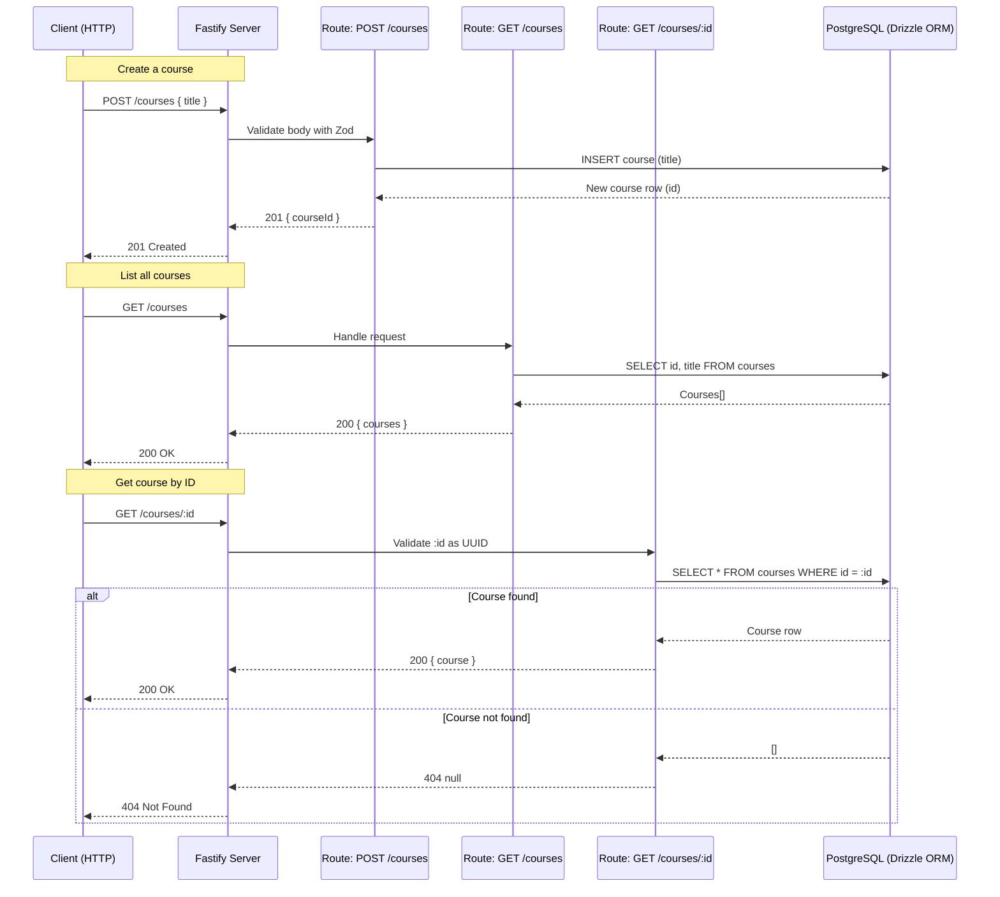

## Node Courses API

This project is a simple REST API built with **Fastify**, **TypeScript**, and **Drizzle ORM** to manage a list of courses stored in a PostgreSQL database.  
It was created as part of a Rocketseat challenge to practice building a Node.js HTTP server from scratch, including validation and documentation.

### Features

- **Create course**: `POST /courses`
- **List courses**: `GET /courses`
- **Get course by ID**: `GET /courses/:id`
- **Database**: PostgreSQL with Drizzle ORM
- **Validation**: Zod + fastify-type-provider-zod
- **API docs**: Swagger + Scalar UI (in development)

### Endpoints

- **POST `/courses`**
  - **Body**
    - `title` (string, min 5 chars, required)
  - **Responses**
    - `201`: `{ "courseId": "uuid" }`

- **GET `/courses`**
  - **Responses**
    - `200`: `{ "courses": [{ "id": "uuid", "title": "string" }] }`

- **GET `/courses/:id`**
  - **Params**
    - `id` (UUID, required)
  - **Responses**
    - `200`: `{ "course": { "id": "uuid", "title": "string", "description": "string | null" } }`
    - `404`: `null` (Course not found)

### Project structure

```text
server.ts              # Fastify server setup, logging, docs and route registration
src/
  database/
    client.ts          # Drizzle Postgres client (uses DATABASE_URL)
    schema.ts          # Drizzle schema for users and courses tables
  routes/
    create-course.ts   # POST /courses
    get-courses.ts     # GET /courses
    get-course-by-id.ts# GET /courses/:id
drizzle/               # Generated SQL migrations and metadata
drizzle.config.ts      # Drizzle CLI configuration
```

### High-level flow (Mermaid diagram)



### Useful scripts

- `npm run dev` – start the Fastify server with `.env` support and file watching
- `npm run db:generate` – generate Drizzle migrations from the schema
- `npm run db:migrate` – apply database migrations
- `npm run db:studio` – open Drizzle Studio to inspect the DB

### License

This project is licensed under the **ISC** license (see `package.json`).


